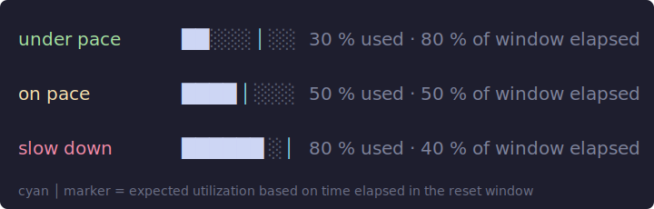
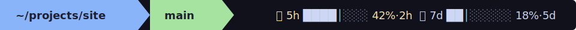
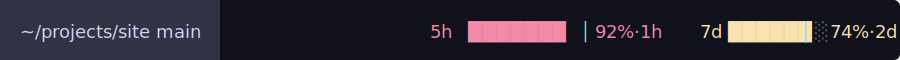

# pi-claude-quota

Powerline footer indicator for [pi](https://pi.dev) that shows your **Claude Code** 5-hour and 7-day quota usage — with a vertical **pace marker** overlaid on each progress bar so you can see at a glance whether you're burning tokens too fast.


## What it shows

```
5h ████│░░░ 42%·2h    7d ██│░░░░░ 18%·5d
       ↑                  ↑
       pace marker        pace marker
```

- **Bar fill** — current utilization (`%`).
- **`│` marker** — bright cyan vertical line indicating *expected* usage based on how much of the window has elapsed.
  - **Marker in the middle of the bar** → you're spending exactly on pace.
  - **Marker to the left of the fill** → you're ahead of pace, time to slow down.
  - **Marker to the right of the fill** → you have headroom, you can work more.
- **Text color** — white / goldenrod / red depending on absolute utilization (configurable thresholds).
- **`%·Xh`** — utilization percent and time until reset.

### Pace examples

| Situation | Bar | Meaning |
|---|---|---|
| 30 % used, 80 % of window elapsed | `██░░░│░░` | well under pace, plenty of room |
| 50 % used, 50 % of window elapsed | `████│░░░` | exactly on pace |
| 80 % used, 40 % of window elapsed | `██████░│` | burning too fast, slow down |



## Install

```bash
# 1. Install the powerline footer (the bar this extension hooks into)
pi install npm:pi-powerline-footer

# 2. Install this extension
pi install git:github.com/dimapanov/pi-claude-quota
```

Then add a custom powerline item to `~/.pi/agent/settings.json`:

```json
{
  "packages": [
    "npm:pi-powerline-footer",
    "git:github.com/dimapanov/pi-claude-quota"
  ],
  "powerline": {
    "preset": "default",
    "customItems": [
      {
        "id": "claude-quota",
        "statusKey": "claude-quota",
        "position": "right",
        "hideWhenMissing": true
      }
    ]
  }
}
```

Restart pi. The indicator appears on the right side of the powerline bar.

## How it works

On `session_start` the extension polls `https://api.anthropic.com/api/oauth/usage` using your Claude Code OAuth access token (read from `~/.claude/.credentials.json` or the macOS Keychain entry `Claude Code-credentials`). The response contains `five_hour` / `seven_day` buckets with `utilization` and `resets_at`. The extension formats them into a colored bar and pushes the result via `ctx.ui.setStatus("claude-quota", …)`.

The pace marker position is computed as:

```
elapsed   = 1 - (resets_at - now) / window
expected  = elapsed * 100
markerPos = clamp((utilization / expected) / 2, 0, 1)   // 0.5 == on pace
```

## Commands

- `/claude-quota` — refresh the cache and re-render immediately.

## Configuration (env vars)

| Variable | Default | Description |
|---|---|---|
| `CLAUDE_USAGE_CREDENTIALS` | `~/.claude/.credentials.json` | Path to credentials JSON |
| `CLAUDE_QUOTA_CACHE_TTL` | `300` (sec) | How long to cache one API response |
| `CLAUDE_QUOTA_BAR_WIDTH` | `8` | Width of each progress bar in chars |
| `CLAUDE_QUOTA_THRESHOLD_LOW` | `50` | Below this % → white text |
| `CLAUDE_QUOTA_THRESHOLD_MED` | `80` | Below this % → goldenrod, above → red |

## Requirements

- pi (`@mariozechner/pi-coding-agent`)
- `pi-powerline-footer` package
- A logged-in Claude Code session (`~/.claude/.credentials.json` exists, or macOS Keychain has the entry)
- Terminal with truecolor / 256-color support and a Powerline-capable font

## Screenshots

Powerline bar in normal usage:



Approaching the limit (red marker, red bar text):



## License

MIT © dimapanov
